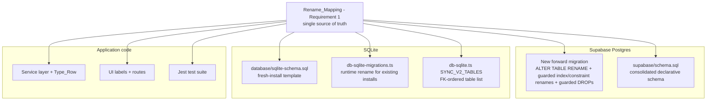

# Design Document

## Overview

This design describes a coordinated, data-preserving rename of five English-named database objects
to Indonesian, the removal of two superseded legacy tables and a set of dormant slot placeholders, the
removal of two stray scope-creep lines in `createCashBookEntry`, and the normalization of user-facing
"Pengurus" labels to "Pegawai". The change spans every storage backend and code surface the project
maintains:

- **Supabase Postgres** — delivered through new forward migrations (already-applied history is
  immutable) plus an update to the consolidated `supabase/schema.sql`.
- **Standalone SQLite** — the fresh-install template `database/sqlite-schema.sql`.
- **SQLite runtime migration runner** — `src/lib/db-sqlite-migrations.ts`, which upgrades existing
  desktop installs on application start, plus the FK-ordered table list in `src/lib/db-sqlite.ts`.
- **TypeScript service layer and row types** — services under `src/lib/services/*` and supporting
  libs under `src/lib/*`.
- **Jest test suite** — files under `src/lib/__tests__/*`.
- **UI** — page text, tab labels, button titles, ARIA labels, and (per-item) route/component
  identifiers that say "Pengurus".

The authoritative old→new mapping is fixed by Requirement 1 and reproduced below. Every surface MUST
apply the same mapping so that a fresh provision, a migrated cloud database, and a migrated local
database all converge on identical Indonesian names.

### Rename Mapping (authoritative)

| Old name (English) | New name (Indonesian) | Kind | Disposition |
| --- | --- | --- | --- |
| `business_actors` | `pegawai` | table | rename |
| `actor_roles` | `peran_pegawai` | table | rename |
| `transaction_computed` | `transaksi_terhitung` | table | rename |
| `transaction_overrides` | `transaksi_penggantian` | table | rename |
| `cashbook_formula` | `rumus_buku_kas` | table | rename |
| `cashbook_partner` | — | table | drop (legacy, superseded) |
| `finance_participants` | — | table | drop (legacy, superseded) |
| `bagi_hasil_slot_1/2/3`, `kasbon_slot_1/2/3` | — | formula keys / source columns | remove (dormant placeholders) |

### Index / constraint rename derivations

| Old index/constraint | New name |
| --- | --- |
| `idx_business_actors_role` | `idx_pegawai_role` |
| `idx_business_actors_active` | `idx_pegawai_active` |
| `idx_business_actors_order` | `idx_pegawai_order` |
| `idx_actor_roles_group` | `idx_peran_pegawai_group` |
| `idx_actor_roles_order` | `idx_peran_pegawai_order` |
| `idx_tc_formula_key` | `idx_transaksi_terhitung_formula_key` |
| `idx_tc_transaction` | `idx_transaksi_terhitung_transaction` |
| `idx_to_formula_key` | `idx_transaksi_penggantian_formula_key` |
| `idx_cashbook_formula_order` | `idx_rumus_buku_kas_order` |
| `idx_cashbook_formula_key` | `idx_rumus_buku_kas_key` |
| `idx_cashbook_formula_actor` | `idx_rumus_buku_kas_actor` |
| `idx_cashbook_formula_group` | `idx_rumus_buku_kas_group` |
| `business_actors_role_code_fkey` (and any embedded-name constraints) | `pegawai_role_code_fkey` |

Indexes/constraints that do not embed a renamed object name (for example `idx_finance_metric_*`) are
left unchanged (Requirement 1.9).

## Architecture

The system keeps three storage backends in sync. The rename must land on each one through the path
that backend uses to evolve its schema:



### Backend-specific rename mechanics

- **Postgres** supports atomic `ALTER TABLE ... RENAME TO`, `ALTER INDEX ... RENAME TO`, and
  `ALTER TABLE ... RENAME CONSTRAINT`. Data is preserved automatically. Renames and drops are wrapped
  in guarded `DO $$ ... $$` blocks (or `IF EXISTS` clauses) so the migration is idempotent and safe to
  re-run against an already-migrated database (Requirements 2.4, 2.6).
- **SQLite** supports `ALTER TABLE ... RENAME TO` and preserves rows, but it does **not** automatically
  carry indexes with the new name in a predictable way, and it cannot `ALTER` a CHECK constraint. The
  runtime runner therefore renames the table (preserving rows) and then **drops and recreates the
  dependent indexes under the Indonesian names** (Requirement 5.3). Where a table also needs a CHECK
  change, the existing drop-and-recreate-with-copy pattern already present in
  `db-sqlite-migrations.ts` is reused (Requirement 8.3).
- **Application code** is a mechanical substitution of table-name string literals, `.from("...")`
  arguments, raw-SQL identifiers, and Type_Row interface names, guided by the mapping.

### Migration ordering and FK safety

`pegawai` (was `business_actors`) has a self-referencing dependency on `peran_pegawai` (was
`actor_roles`) via `role_code`. Other tables (`komponen_kompensasi`, `slip_gaji`,
`pinjaman_karyawan`, and `rumus_buku_kas`) carry `actor_id` FKs to `business_actors`. Because
`ALTER TABLE ... RENAME` keeps the table's identity (the FK target follows the rename automatically in
both Postgres and SQLite), no FK needs to be dropped and re-added on rename. However:

- `SYNC_V2_TABLES` ordering MUST list `peran_pegawai` before `pegawai` (Requirement 5.4).
- The two legacy drops (`cashbook_partner`, `finance_participants`) MUST run only after confirming no
  retained table FK references them (Requirement 2.5). `finance_metric_mappings.participant_id`
  references `finance_participants`; this dependency is handled in the Data Models section below.

## Components and Interfaces

### 1. Supabase forward migration (new file)

A new migration file under `supabase/migrations/` with a timestamp later than the latest existing
file (`20260610000000_drop_legacy_person_columns.sql`). Proposed name:
`20260611000000_rename_english_tables_to_indonesian.sql`.

Responsibilities:
1. Rename the five tables with guarded `ALTER TABLE ... RENAME TO`.
2. Rename dependent indexes and constraints with guarded `ALTER INDEX`/`ALTER TABLE ... RENAME
   CONSTRAINT` statements.
3. Handle the `finance_metric_mappings.participant_id → finance_participants` FK before dropping
   `finance_participants` (drop the FK / the dependent table per the decision in Data Models).
4. Drop `cashbook_partner` and `finance_participants` with `DROP TABLE IF EXISTS`, guarded by a
   row-count confirmation step (Requirement 8.4 — see Error Handling).

Idempotency pattern (per table):

```sql
DO $$
BEGIN
  IF EXISTS (SELECT 1 FROM information_schema.tables
             WHERE table_schema = 'public' AND table_name = 'business_actors')
     AND NOT EXISTS (SELECT 1 FROM information_schema.tables
             WHERE table_schema = 'public' AND table_name = 'pegawai') THEN
    ALTER TABLE public.business_actors RENAME TO pegawai;
  END IF;
END $$;
```

Index/constraint renames use the same guard style:

```sql
ALTER INDEX IF EXISTS idx_business_actors_role RENAME TO idx_pegawai_role;
```

This satisfies "complete without error when already renamed" (Requirement 2.6) because each guard is a
no-op once the target name exists.

> Note: existing already-applied migration files are **not** edited (Requirement 2.2). If any migration
> file is confirmed *not yet applied to cloud*, it MAY be edited instead of adding redundant forward
> statements, but the default and safe path is a new forward migration.

### 2. Supabase consolidated schema — `supabase/schema.sql`

A fresh provision from this file must match the migrated cloud state (Requirement 3). Edits:
- Rename every `CREATE TABLE`, `CREATE INDEX`, FK `REFERENCES`, and RLS policy statement for the five
  renamed tables to their Indonesian names (Requirement 3.1).
- Remove the `CREATE TABLE`/index/RLS statements for `cashbook_partner` and `finance_participants`
  (Requirement 3.2). `finance_participants` lives in this file at the block around lines 1204–1234,
  and `finance_metric_mappings.participant_id` FK to it must be resolved (see Data Models).
- Update every FK that references a renamed table — `komponen_kompensasi.actor_id`,
  `proses_gaji`/`slip_gaji.actor_id`, `pinjaman_karyawan.actor_id`, and `rumus_buku_kas.actor_id` —
  to reference the new table name (Requirement 3.3).

### 3. SQLite fresh-install schema — `database/sqlite-schema.sql`

- Rename every `CREATE TABLE`, `CREATE INDEX`, and FK `REFERENCES` statement for the five renamed
  tables (Requirement 4.1).
- Remove `cashbook_partner` and `finance_participants` definitions, and update/remove the
  `finance_metric_mappings.participant_id` FK accordingly (Requirement 4.2).

### 4. SQLite runtime migration runner — `src/lib/db-sqlite-migrations.ts`

New exported function `migrateEnglishTablesToIndonesian(db)`, invoked from
`ensureServerSQLiteSyncV2Schema` **before** the existing `ensure*`/`migrate*` helpers run against the
new names, so subsequent bootstrap statements operate on the renamed tables.

Per-table algorithm (idempotent):

```
for (old, new) in renameMapping:
    if table 'new' exists: continue            # already migrated (Req 5.2)
    if table 'old' not exists: continue        # fresh install from updated schema (Req 5.5)
    PRAGMA foreign_keys = OFF
    BEGIN TRANSACTION
        ALTER TABLE <old> RENAME TO <new>       # preserves rows (Req 5.1)
        drop old-named dependent indexes
        create Indonesian-named indexes (Req 5.3)
    COMMIT
    PRAGMA foreign_keys = ON
```

Also in this file:
- The existing bootstrap `CREATE TABLE IF NOT EXISTS` blocks for the five tables are renamed to the
  Indonesian names, and the `cashbook_partner` / `finance_participants` create + seed/delete
  statements are removed (the `DELETE FROM cashbook_partner` cleanup and `finance_participants` column
  backfills become dead and are removed).
- `migrateCashbookFormulaDbColumnNullable` is updated to target `rumus_buku_kas` (table name, index
  names, and the `_v2` temp-table flow). Its guard query (`SELECT sql FROM sqlite_master WHERE
  name = 'cashbook_formula'`) must check the new name; the rename runs before this helper so the
  helper sees `rumus_buku_kas`.

### 5. SQLite table order — `src/lib/db-sqlite.ts`

`SYNC_V2_TABLES` is updated: replace `actor_roles`→`peran_pegawai`, `business_actors`→`pegawai`,
`finance_participants` removed, keeping `peran_pegawai` before `pegawai` (Requirement 5.4). The pull
loop in `db-unified.ts` (`for (const table of SYNC_V2_TABLES)`) then pulls the renamed tables by their
new names with no further change.

### 6. Service layer + Type_Row — `src/lib/services/*`, `src/lib/*`

Mechanical substitutions guided by the mapping:
- `db.query`/`db.queryOne`/`db.insert`/`db.update`/`db.delete` first-argument string literals
  (e.g. `"business_actors"` → `"pegawai"`, `"actor_roles"` → `"peran_pegawai"`).
- Supabase `.from("...")` calls (e.g. `transaction_computed`, `transaction_overrides`,
  `cashbook_formula`).
- Raw SQL in `transaction-computed-service.ts`, `finance-service.ts`, `cashbook-formula-service.ts`,
  `finance-config-service.ts`, etc.
- `tableExists`/runtime presence checks referencing renamed tables (Requirement 6.3).
- Type_Row interface renames for clarity: `BusinessActorRow` → `PegawaiRow`,
  `RawBusinessActorRow` → `RawPegawaiRow` (and `ActorRole`/role row types as applicable), updated
  consistently at all usages via symbol rename (Requirement 6.2).
- The graceful "does not exist" degradation in Supabase queries is preserved, just keyed on the new
  table name (Requirement 6.4).

Files that read/write `finance_participants` (`finance-config-service.ts`, `cashbook-config-sync.ts`)
require special handling because the table is being dropped — see Data Models (legacy-table removal).

### 7. `createCashBookEntry` dead-code removal — `src/lib/services/finance-service.ts`

Remove the two stray lines from the `entry` object:

```ts
reference_type: data.keperluan?.includes("[REF:") ? "system" : null,
reference_id: null,
```

Before removal, confirm no reader depends on `createCashBookEntry` setting these fields. If the
`keuangan` insert requires them, the function is allowed to fail rather than substitute placeholders
(Requirement 9.4).

### 8. Slot-placeholder removal — `src/lib/profit-share-config.ts`, `src/lib/finance-slot-labels.ts`

- Remove `PROFIT_SHARE_SLOTS` entries keyed on `bagi_hasil_slot_1/2/3` + `kasbon_slot_1/2/3`
  (Requirements 10.1, 10.2). Because `PROFIT_SHARE_SLOTS` is consumed by `slotForSourceColumn`,
  `defaultProfitSharePartners`, `findAvailableProfitShareSlot`, `findOrphanProfitShareSlot`, and
  `resolveProfitShareSlotForNewPartner`, those consumers must continue to compile and behave correctly
  with an empty/real slot set (Requirement 10.4). The likely outcome: `PROFIT_SHARE_SLOTS` becomes an
  empty array (slots are now driven entirely by `finance_metric_mappings`), and the helper functions
  degrade to "no default slots".
- Remove the `bagi_hasil_slot_*` / `kasbon_slot_*` entries from `FINANCE_SLOT_LABELS`
  (Requirement 10.3).
- No applied cloud schema object stores these placeholders as columns (they are config/source-column
  keys), so no new migration is required for the removal; if a backend schema object is found to embed
  them, it is handled via the same new forward migration (Requirement 10.5).

### 9. UI label normalization (Pengurus → Pegawai)

User-facing string replacements across `src/app/**` and `src/components/**`:
- Page text, tab labels, button `title`s, `aria-label`s, notifications (Requirement 11.1).
- Preserve surrounding sentence structure and meaning (Requirement 11.2).

Identifier decisions (Requirement 11.3) — decided per item:

| Item | Decision | Rationale |
| --- | --- | --- |
| `PengaturanTab` value `"pengurus"` and `pengaturanDefaultTab` state | **Keep identifier**, change visible label to "Pegawai" | Internal-only string; renaming risks churn with no user benefit |
| `TabPengurus` component / file name | **Keep identifier**, change rendered label | Component name is not user-facing |
| Route `src/app/kelola-pengurus/page.tsx` (redirect stub) | **Keep route**, update visible text to "Pegawai" | Existing redirect/bookmark compatibility must be preserved (Requirement 11.3) |
| `DynamicActorSummary` heading "Pengurus Usaha", counts, hints | Change visible text to "Pegawai" | User-facing |

Occurrences inside already-applied Supabase migration **comments** (e.g.
`20260522030000_cleanup_legacy_seed_data.sql`, `20260521090000_business_actors_v2.sql`) are left
unchanged (Requirements 11.1, 11.4). Note these comments also contain the literal table name
`business_actors`; because those files are immutable, the comments stay as-is and only describe
historical state.

### 10. Test suite — `src/lib/__tests__/*`

Update `mockTable("business_actors")` → `mockTable("pegawai")` (in
`pinjaman-karyawan-service.test.ts`, `penggajian-service.test.ts`), the
`UPDATE cashbook_formula ...` regex in `return-finance.test.ts` → `rumus_buku_kas`, and any other
renamed-table references (Requirement 7.1). The suite must pass with no naming-attributable failures
(Requirement 7.2).

## Data Models

The rename does not change any column, type, or row shape — only object names. The row data of every
retained table is preserved (Requirement 8.1, 8.2). The logical models are unchanged; only their table
names differ:

- `pegawai` (was `business_actors`): `id`, `display_name`, `role_code` (FK → `peran_pegawai.role_code`),
  `is_active`, `display_order`, `notes`, `profit_share_percent`, `cash_advance_categories`,
  `keperluan_keyword`, `bonus_percent`, `bonus_source_formula_key`, timestamps.
- `peran_pegawai` (was `actor_roles`): `id`, `role_code` (unique), `role_label`, `role_group`,
  `description`, `display_order`, timestamps.
- `transaksi_terhitung` (was `transaction_computed`): `transaction_id` (FK → `keuangan.id`),
  `formula_key`, `value`, `computed_at`; PK `(transaction_id, formula_key)`.
- `transaksi_penggantian` (was `transaction_overrides`): `transaction_id` (FK → `keuangan.id`),
  `formula_key`, `override_value`, `overridden_at`; PK `(transaction_id, formula_key)`.
- `rumus_buku_kas` (was `cashbook_formula`): `id`, `name`, `column_key`, `db_column` (nullable), `ast`,
  `enabled`, `is_system`, `display_order`, `description`, plus additive columns `formula_key`,
  `actor_id` (FK → `pegawai.id`), `formula_group`, `is_visible_in_summary`, timestamps.

### Tables scheduled for removal

- **`cashbook_partner`** — no retained FK references it. Safe to drop after row-count confirmation.
- **`finance_participants`** — `finance_metric_mappings.participant_id` has an FK to it
  (`ON DELETE SET NULL`). Because the requirement removes `finance_participants` from both schemas, the
  migration must first drop the `finance_metric_mappings_participant_id_fkey` constraint (and the
  consolidated schema must drop the `FOREIGN KEY (participant_id) REFERENCES finance_participants`
  clause). The `participant_id` column itself is retained (now a free-standing nullable column) unless
  the maintainer requests its removal, to avoid scope creep beyond the mapping.

### Data-loss guard for removal (Requirement 8.4)

`cashbook_partner` and `finance_participants` may contain rows. The migration MUST confirm with the
maintainer before dropping a non-empty removal-scheduled table. See Error Handling for the mechanism.

### FK identity preservation

Because both Postgres and SQLite implement `ALTER TABLE ... RENAME` as an in-place identity-preserving
operation, FKs pointing at a renamed table (`actor_id → business_actors`) continue to point at the same
table object under its new name without being dropped/recreated. This is the basis for the data-
preservation guarantee (Requirements 8.1, 8.2) and is why drop-and-recreate is used only where a
storage-engine limitation forces it (Requirement 8.3).

## Error Handling

- **Idempotent / guarded migrations (Req 2.4, 2.6, 5.2, 5.5):** Each Postgres rename/drop is wrapped in
  an existence guard; each SQLite rename checks for the presence of the old table and absence of the new
  one before acting. Re-running against an already-migrated database is a no-op and raises no error.
- **SQLite transactional safety (Req 5.1, 5.3, 8.3):** Each table rename + index recreation runs inside
  a `BEGIN`/`COMMIT` with `foreign_keys = OFF` during the operation, mirroring the existing
  `inventory_movements` rebuild pattern, with `ROLLBACK` on exception so a partial rename never leaves a
  corrupt schema.
- **Non-empty removal-scheduled tables (Req 8.4):** Before dropping `cashbook_partner` or
  `finance_participants`, run a `SELECT COUNT(*)`. If rows exist, **pause and confirm with the
  maintainer** before issuing the `DROP`. In the forward Postgres migration this is encoded as a guarded
  `RAISE EXCEPTION` (or a clearly commented manual-confirmation gate) so the drop cannot silently
  destroy data; the decision is surfaced to the maintainer during task execution rather than executed
  blindly.
- **`createCashBookEntry` field removal (Req 9.4):** If the `keuangan` insert path requires
  `reference_type`/`reference_id`, the function is allowed to fail rather than substitute placeholder
  values. Verify (via grep of readers of those fields) that nothing depends on `createCashBookEntry`
  populating them before removing the lines.
- **Service-layer graceful degradation (Req 6.4):** The existing `error.message.includes("does not
  exist")` / `"schema cache"` tolerance in `transaction-computed-service.ts` and `finance-service.ts`
  is preserved, keyed on the new table names, so a backend that has not yet applied the rename degrades
  gracefully instead of throwing.
- **EOL preservation (Req 12):** All edits to existing files preserve the file's existing EOL sequence
  and introduce no EOL-only diffs on untouched lines. New files (the forward migration) use the most
  common EOL among sibling `.sql` files in `supabase/migrations/`, falling back to `LF` on a tie.

## Testing Strategy

### Why property-based testing does not apply

This feature is a schema/identifier rename refactor. Its work products are:
1. Declarative SQL schema edits and forward migrations (Infrastructure-as-Code).
2. Mechanical find-and-replace of table-name string literals and Type_Row names.
3. Removal of dead code and dormant config entries.
4. User-facing string label changes.

None of these introduce a pure function with a meaningful "for all inputs X, property P(X) holds"
statement. The correctness criteria are deterministic and example-shaped ("the migration renames table
A to B and preserves its rows", "no source file references the old name", "the suite still passes").
Per the workflow's PBT-applicability rules (IaC, simple CRUD, configuration, and side-effect-only
operations are explicitly excluded), property-based testing is **not** used here and no Correctness
Properties section is included. Verification relies on the existing example-based suite plus the
project's standard gates.

### Regression test suite (existing Jest tests)

The existing suite is the primary functional guard. After the rename, all tests must pass with no
naming-attributable failures (Requirement 7.2). Updated tests:
- `pinjaman-karyawan-service.test.ts`, `penggajian-service.test.ts` — `mockTable("pegawai")`.
- `return-finance.test.ts` — `rumus_buku_kas` in the `UPDATE` regex.
- Any other `*.test.ts(x)` referencing a renamed table.

### Targeted verification checks (manual / scripted during task execution)

- **Mapping-consistency grep:** After edits, a repository-wide search for the old names
  (`business_actors`, `actor_roles`, `transaction_computed`, `transaction_overrides`,
  `cashbook_formula`, `cashbook_partner`, `finance_participants`) returns matches **only** inside
  already-applied Supabase migration files (immutable history) — never in `schema.sql`,
  `database/sqlite-schema.sql`, `src/**`, or test files (Requirements 1.10, 3, 4, 6, 7).
- **SQLite rename behavior (example/integration check):** Against a temporary SQLite database seeded
  with an old-named table containing sample rows, run `ensureServerSQLiteSyncV2Schema` and assert: the
  Indonesian-named table exists, the old name is gone, all seeded rows are present, and the Indonesian-
  named indexes exist (Requirements 5.1, 5.3, 8.1). Re-running is a no-op (Requirements 5.2, 5.5).
- **Migration idempotency (integration check):** Apply the forward migration twice against a local
  Postgres/Supabase instance; the second run completes without error (Requirement 2.6).
- **Slot-placeholder removal compile check:** `npm run type-check` confirms all consumers of the
  removed slot definitions still compile (Requirement 10.4).

### Standard verification gates (Requirement 13)

The refactor is complete only when all of the following pass; any failure is resolved before declaring
completion (Requirement 13.5):
- `npm run type-check` → zero errors (13.1).
- `npm run build` → success (13.2).
- `npx jest` → all pass (13.3).
- No new ESLint warnings/errors on changed files (13.4).
