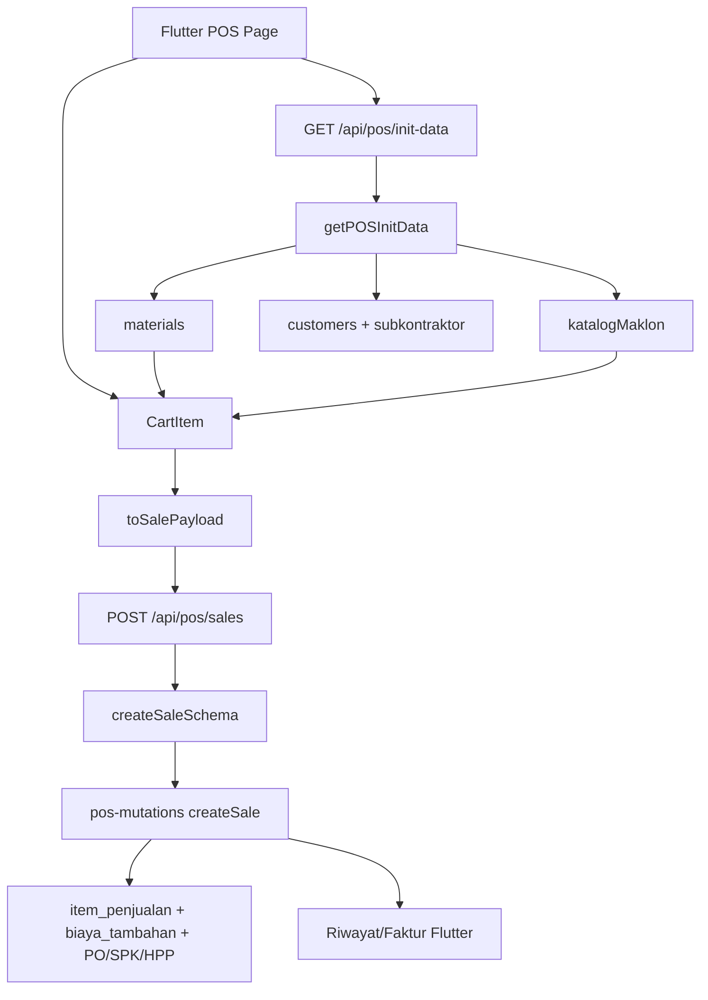

# Desain: Sinkronisasi Perubahan POS/Kasir Web ke Flutter

Tanggal: 2026-07-12
Status: Spec tertulis berdasarkan audit Git + rekomendasi scope mobile-simple

## Ringkasan Eksekutif

Commit terakhir yang menyentuh Flutter adalah:

- Hash: `cec0a5d152426dc3460a96bc927522cc45e8ae3e`
- Tanggal: `2026-07-04 02:14:00 +1000`
- Subject: `feat: struk/faktur/SPK — qty lembar + ukuran, biaya per item, Sisa/Kembalian dinamis`

Setelah commit tersebut, `HEAD` berada di `f676ea6` dan ada **80 commit** baru. Perubahan POS/Kasir web yang relevan terjadi terutama pada rentang `ddf0d82..886568d`, mencakup katalog maklon/extra, pending vendor/HPP, metode vendor `TRANSFER`, snapshot nama produk jual, BOM/HPP per produk jual, modal biaya tambahan, dan maklon berdimensi.

Desain ini memilih pendekatan **mobile-pragmatic parity**: Flutter POS mengikuti kontrak data dan fitur kasir yang berdampak pada transaksi, tetapi tidak membawa fitur web yang berat/desktop-oriented seperti PPN/NSFP, parkir keranjang, preview faktur sebelum checkout, tambah/edit katalog maklon/extra, dan admin CRUD katalog.

Keputusan tambahan setelah klarifikasi scope: **mobile hanya menampilkan dan memakai katalog maklon/extra yang sudah ada dari web**. Pembuatan, quick-add, edit, dan maintenance katalog tetap hanya di web app. Fitur **“Lihat Faktur” tetap dipertahankan** karena sudah ada di Flutter melalui detail Riwayat Penjualan; scope fase ini hanya memperbaiki data label faktur/riwayat agar memakai snapshot `nama_produk_jual`.

## Audit Git: Perubahan POS/Kasir Setelah Flutter Terakhir

| Area | Commit utama | Dampak ke Flutter |
|---|---|---|
| Katalog maklon/extra + keranjang tersimpan | `ddf0d82`, `1b53ff0`, `443b913`, `7673078`, `b33d959` | Katalog maklon existing perlu bisa dikonsumsi Flutter POS. Tambah/edit katalog dan keranjang tersimpan ditunda karena mobile app simple. |
| Metode bayar vendor `TRANSFER` | `00fc1be`, `d028108` | Flutter maklon perlu opsi `TRANSFER`; backend schema REST perlu selaras. |
| Katalog extra tanpa wajib vendor/HPP + pending maklon | `3271b4c`, `bcb6ed8`, `182681f`, `0fe97cb`, `976d92f` | Flutter perlu bisa memasukkan item katalog maklon existing yang belum punya vendor/biaya sebagai pending, bukan memblokir transaksi. |
| Produk jual flat + snapshot nama produk jual | `c83aa9a`, `d24d80c` | Flutter minimal wajib mengirim `nama_produk_jual` dari `MaterialPrice.displayLabel`; grid mobile boleh tetap per barang untuk sederhana. |
| BOM/HPP per produk jual | `930a405`, `3036797`, `d24d80c` | Mostly backend; Flutter wajib menjaga `harga_satuan_id` benar. |
| Biaya tambahan dengan modal | `a7ad8d4`, `499ce85`, `742da4b`, `cc35510`, `1e54f78`, `6c97b87` | Flutter `ItemBiaya` perlu `modal`, validasi `0 <= modal <= nominal`, dan kirim payload. |
| Maklon berdimensi harga per m² | `5f03ab4`, `886568d` | Katalog maklon Flutter perlu input dimensi jika `butuh_dimensi_status=1`. |
| Popular sort | `ffdced6`, `63a31eb` | Ditunda; bukan kebutuhan inti mobile-simple. |
| Nomor faktur/SPK date format + preview faktur | `1054d02`, `cbae388` | Nomor tetap backend concern; preview sebelum checkout ditunda. Riwayat/faktur Flutter cukup menampilkan snapshot produk yang benar. |
| Periode akuntansi | `459b32a` | Backend otomatis isi `periode_id`; Flutter tidak perlu kirim. |

## Brainstorming: Opsi Pendekatan

### Opsi A — Full parity POS web

Membawa semua fitur web: grid produk jual flat, katalog maklon, tambah barang maklon/katalog extra, tambah item lainnya, parkir keranjang, faktur preview, PPN/NSFP, popular sort, dan print flow.

- Kelebihan: UX web dan mobile sangat sama.
- Kekurangan: terlalu besar untuk mobile app yang sengaja simple; risiko regresi tinggi; banyak fitur desktop kasir tidak nyaman di layar kecil.

### Opsi B — Mobile-pragmatic parity (direkomendasikan)

Membawa perubahan yang memengaruhi kebenaran transaksi dan fitur POS yang sudah ada di Flutter: katalog maklon existing sebagai item POS, payload snapshot produk jual, biaya tambahan modal, vendor `TRANSFER`, maklon pending/dimensi, catatan/prioritas, dan tampilan riwayat/faktur yang memakai snapshot. Flutter tidak membuat atau mengelola katalog.

- Kelebihan: transaksi dari Flutter konsisten dengan web/backend; scope tetap kecil dan sesuai halaman Flutter yang sudah ada.
- Kekurangan: beberapa fitur web tetap tidak tersedia di mobile.

### Opsi C — Backend-only compatibility

Tidak mengubah UI Flutter selain payload minimal; cukup pastikan transaksi lama tidak rusak.

- Kelebihan: paling cepat dan aman.
- Kekurangan: tidak memenuhi kebutuhan porting improvement POS/Kasir web yang terlihat oleh kasir mobile.

**Keputusan:** gunakan **Opsi B**. Ini paling sesuai dengan instruksi “mobile app sangat simple” dan tetap membawa perubahan POS/Kasir yang benar-benar penting. Batas tegasnya: katalog maklon/extra di Flutter adalah **read-only catalog source dari web**; mobile hanya memilih item existing dan memasukkannya ke cart.

## Scope In

### 1. Backend REST contract untuk Flutter POS

Flutter memakai REST `/api/pos/init-data`, bukan server action web. Saat ini `getPOSInitData()` sudah mengembalikan `katalogMaklon`, tetapi route REST `src/app/api/pos/init-data/route.ts` hanya mengirim `customers`, `materials`, `sales`, dan `subkontraktor`.

Perubahan:

- Tambahkan `katalogMaklon: data.katalogMaklon ?? []` ke response REST.
- Selaraskan `src/lib/schemas/pos.ts` agar `metode_bayar_vendor` menerima `"TRANSFER"`, karena tipe service dan migrasi POS web sudah mendukungnya.
- Pertahankan `.passthrough()` dan validasi server sebagai otoritas.

### 2. Model Flutter POS

File utama:

- `flutter/lib/features/pos/models/cart_item.dart`
- `flutter/lib/features/pos/models/katalog_maklon.dart` (baru)
- `flutter/lib/models/material_item.dart`
- `flutter/lib/models/sale.dart`

Perubahan:

- `ItemBiaya` tambah `modal` default `0` dan `toJson()` mengirim `modal` hanya bila `> 0`.
- `CartItem` tambah:
  - `namaProdukJual`
  - `jumlahRoll`
  - `recommendedRollWidthM`
  - `katalogMaklonId`
  - `metodeBayarVendor` mendukung `CASH | NET30 | TRANSFER`
- `toSalePayload()` mengirim:
  - `nama_produk_jual`
  - `jumlah_roll`
  - `recommended_roll_width_m`
  - `katalog_maklon_id`
  - `biaya_tambahan[].modal`
- `SaleItem` tambah `namaProdukJual` dan getter display name agar riwayat/faktur menggunakan snapshot produk jual sebelum fallback ke `barangNama`.

### 3. POS Flutter tetap simple, tapi bisa konsumsi katalog maklon existing

File utama:

- `flutter/lib/features/pos/pos_page.dart`
- `flutter/lib/features/pos/widgets/product_grid.dart`
- `flutter/lib/features/pos/widgets/katalog_maklon_sheet.dart` (baru)

Perubahan UX:

- Grid produk tetap berbasis `MaterialItem` untuk menghindari perubahan besar ke flat product grid.
- Katalog maklon/extra di Flutter bersifat read-only dari API: tidak ada tombol buat katalog baru, quick-add, edit nama/satuan/template, atau maintenance vendor/HPP katalog.
- Search material diperluas agar cocok dengan `MaterialPrice.displayLabel` / `namaProdukJual`.
- Katalog maklon existing ditampilkan sebagai kartu POS tambahan sederhana dengan badge `Maklon` dan `m²` jika `butuh_dimensi_status=1`.
- Kategori menggabungkan `MaterialItem.kategoriNama` dan `KatalogMaklon.kategoriNama`.
- Jika user tap katalog maklon existing:
  - Untuk non-dimensi: input jumlah, harga jual default bisa dioverride.
  - Untuk dimensi: input lebar, panjang, jumlah/lembar default `1`; `jumlah = lebar × panjang × jumlahRoll`.
  - Vendor/biaya/metode diisi dari template jika ada.
  - Jika vendor/biaya belum lengkap, item tetap boleh masuk cart sebagai pending maklon, membawa `katalog_maklon_id`.

### 4. Barang biasa: snapshot produk jual dan roll metadata

`showAddItemSheet()` saat membuat `CartItem` harus:

- Mengisi `namaProdukJual` dari `_price.displayLabel`.
- Untuk item berdimensi, mengisi `jumlahRoll: 1` karena Flutter saat ini tidak punya input jumlah lembar/roll untuk barang biasa.
- Mengisi `recommendedRollWidthM` dari roll yang dipilih (`selectedRollSize`) agar backend roll/HPP/inventori mendapat field baru, sambil tetap mengirim `selectedRollSize` untuk kompatibilitas lama.

### 5. Biaya tambahan dengan modal

File utama:

- `flutter/lib/features/pos/models/cart_item.dart`
- `flutter/lib/features/pos/widgets/add_item_sheet.dart`
- `flutter/test/pos/cart_item_test.dart`

Perubahan UX:

- Dialog “Biaya Tambahan” tetap satu dialog kecil.
- Tambahkan field opsional `Modal` di bawah `Nominal`.
- Validasi: label wajib, nominal `> 0`, modal `>= 0`, modal `<= nominal`.
- Modal adalah informasi internal; jangan tampilkan di struk/faktur customer. Di cart boleh ditampilkan kecil sebagai “Modal Rp …” agar kasir tahu data tersimpan.

### 6. Maklon ad-hoc yang sudah ada di Flutter

File utama:

- `flutter/lib/features/pos/widgets/maklon_form_sheet.dart`

Perubahan:

- Tambahkan chip metode vendor `TRANSFER`.
- Untuk maklon ad-hoc manual, vendor dan biaya tetap wajib agar perilaku lama aman. Pending vendor/HPP hanya diterapkan untuk item yang berasal dari katalog maklon dan membawa `katalog_maklon_id`.

### 7. Payment metadata ringan

File utama:

- `flutter/lib/features/pos/widgets/payment_sheet.dart`
- `flutter/lib/features/pos/pos_page.dart`

Perubahan:

- `PaymentResult` tambah `catatan` dan `prioritas`.
- Sheet bayar tambah:
  - toggle prioritas `NORMAL/KILAT`, default `NORMAL`
  - input opsional `Catatan`
- Checkout mengirim `catatan` jika terisi dan `prioritas` sesuai pilihan.

### 8. Riwayat penjualan / faktur Flutter

File utama:

- `flutter/lib/models/sale.dart`
- `flutter/lib/features/sales_history/sales_history_page.dart`
- `flutter/lib/core/penjualan_cetak_utils.dart`

Perubahan:

- Fitur `Lihat Faktur` yang sudah ada di detail Riwayat Penjualan tetap dipertahankan.
- Parse `nama_produk_jual` pada `SaleItem`.
- Gunakan `nama_produk_jual` sebagai label item jika ada, lalu fallback ke `barang_nama` / `nama_barang`.
- Tetap tidak menampilkan `modal` biaya tambahan di output customer.
- Tidak menambahkan web-style faktur preview sebelum checkout; checkout POS mobile tetap boleh sederhana seperti sekarang kecuali ada permintaan terpisah.

## Scope Out / Ditunda Sengaja

Fitur berikut **tidak dibawa di fase ini** karena tidak perlu untuk mobile app simple atau terlalu desktop/web-oriented:

- Parkir/Simpan/Muat keranjang (`keranjang_tersimpan`).
- Preview “Lihat Faktur” sebelum transaksi.
- PPN/NSFP/Faktur Pajak dari POS mobile.
- Popular sort/toggle dan manual popular override.
- Tambah Barang Maklon / Katalog Extra dari Flutter.
- Quick-add katalog extra/maklon dari Flutter.
- Create/edit/delete/admin CRUD katalog maklon di Flutter.
- Print thermal otomatis dari checkout POS mobile.
- Notifikasi terpusat web.
- Perubahan Beranda/PO/Laporan/Demo role yang bukan halaman POS Flutter.
- Tauri/SQLite sync detail yang tidak dipakai Flutter online-only.

Jika salah satu fitur scope-out dibutuhkan, buat spec terpisah agar tidak mencampur mobile-simple parity dengan workflow desktop.

## Arsitektur Data Flow



## Kontrak Payload yang Harus Dicapai

Contoh item barang biasa berdimensi:

```json
{
  "barang_id": "barang-1",
  "harga_satuan_id": "harga-1",
  "nama_satuan": "m²",
  "nama_produk_jual": "Banner Flexi 280",
  "faktor_konversi": 1,
  "jumlah": 3.6,
  "jumlah_roll": 1,
  "harga_satuan": 25000,
  "subtotal": 90000,
  "panjang": 1.2,
  "lebar": 2.7,
  "billed_panjang": 1.2,
  "billed_lebar": 3,
  "recommended_roll_width_m": 3,
  "selectedRollSize": 3,
  "biaya_tambahan": [
    { "label": "Ongkir", "nominal": 20000, "modal": 20000 }
  ]
}
```

Contoh item katalog maklon pending:

```json
{
  "barang_id": "barang-jasa-maklon",
  "harga_satuan_id": "harga-jasa-maklon",
  "nama_satuan": "pcs",
  "nama_produk_jual": "Hardcover Custom",
  "faktor_konversi": 1,
  "jumlah": 1,
  "harga_satuan": 120000,
  "subtotal": 120000,
  "tipe_item": "MAKLON",
  "deskripsi_pekerjaan": "Hardcover Custom",
  "katalog_maklon_id": "kat-1",
  "vendor_subkontrak_id": null,
  "biaya_subkontrak": null,
  "metode_bayar_vendor": null
}
```

Contoh item katalog maklon lengkap dengan vendor `TRANSFER`:

```json
{
  "barang_id": "barang-jasa-maklon",
  "harga_satuan_id": "harga-jasa-maklon",
  "nama_satuan": "m²",
  "nama_produk_jual": "UV Board Maklon",
  "faktor_konversi": 1,
  "jumlah": 2,
  "jumlah_roll": 1,
  "harga_satuan": 85000,
  "subtotal": 170000,
  "panjang": 2,
  "lebar": 1,
  "tipe_item": "MAKLON",
  "deskripsi_pekerjaan": "UV Board Maklon",
  "katalog_maklon_id": "kat-2",
  "vendor_subkontrak_id": "vendor-1",
  "biaya_subkontrak": 100000,
  "metode_bayar_vendor": "TRANSFER"
}
```

## Error Handling

- Jika `/api/pos/init-data` tidak mengandung `katalogMaklon`, Flutter harus fallback ke list kosong agar kompatibel dengan server lama.
- Jika katalog maklon belum punya vendor/biaya, tampilkan label kecil “Pending vendor/HPP” pada sheet sebelum masuk cart.
- Jika modal biaya tambahan melebihi nominal, blok di Flutter dengan pesan `Modal tidak boleh melebihi nominal` sebelum payload dikirim.
- Jika backend tetap menolak `TRANSFER` karena schema belum deploy, error dari API ditampilkan seperti error checkout lain; task backend schema harus dilakukan sebelum merilis Flutter.

## Testing / Definition of Done

- Unit test Dart:
  - `flutter test test/pos/cart_item_test.dart`
  - `flutter test test/models/sale_model_test.dart` atau test model yang ada
- Widget smoke test:
  - `flutter test test/features/sales_history_page_test.dart`
- Full Flutter test:
  - `flutter test`
- Web/backend targeted test:
  - `npx jest src/lib/__tests__/pos-schema-mobile-parity.test.ts`
  - `npm run type-check`
- Manual regression POS Flutter:
  - checkout barang biasa non-dimensi
  - checkout barang dimensi dengan roll
  - checkout biaya tambahan tanpa modal
  - checkout biaya tambahan dengan modal
  - checkout maklon ad-hoc vendor `TRANSFER`
  - checkout katalog maklon existing lengkap
  - checkout katalog maklon existing pending vendor/HPP
  - checkout katalog maklon existing berdimensi
  - buka riwayat/faktur dan pastikan nama produk jual tampil benar

## Self-review Spec

- Tidak ada placeholder/TBD.
- Scope fokus pada halaman Flutter yang sudah ada: POS dan Riwayat Penjualan/Faktur.
- Fitur web yang tidak perlu untuk mobile-simple ditunda eksplisit, termasuk tambah/edit katalog maklon/extra dari Flutter.
- Kontrak payload menyebut nama field snake_case backend dan camelCase Flutter.
- Risiko schema `TRANSFER` teridentifikasi sebagai task backend REST/schema sebelum Flutter release.
