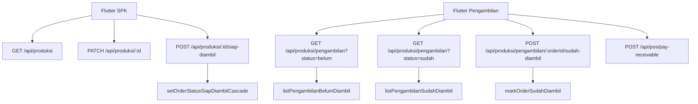

# Desain: Sinkronisasi SPK Web ke Flutter dan Halaman Pengambilan Mobile

Tanggal: 2026-07-12
Status: Spec tertulis berdasarkan audit git history dan scope mobile-simple

## Ringkasan

Commit terakhir yang menyentuh Flutter adalah:

- Hash: `cec0a5d152426dc3460a96bc927522cc45e8ae3e`
- Tanggal: `2026-07-04 02:14:00 +1000`
- Subject: `feat: struk/faktur/SPK — qty lembar + ukuran, biaya per item, Sisa/Kembalian dinamis`

Setelah commit tersebut, perubahan web yang relevan untuk SPK/Pengambilan terjadi terutama pada 2026-07-04 sampai 2026-07-12:

- `626a25c` menambah status order `SIAP_AMBIL`.
- `afb35d6` / `3411008` / `57550a7` menambah alur `Siap Diambil` dan `Sudah Diambil`.
- `6fff319` menambah service list Pengambilan dengan enrichment status piutang.
- `57550a7` menambah halaman web Pengambilan.
- `0fe97cb` memperbaiki status `Siap Diambil`, `Pelanggan Umum`, dan API produksi.
- `d24d80c` memperbaiki snapshot nama produk jual pada tampilan SPK/Pengambilan.
- `cbae388` memindahkan notifikasi web dan format nomor, tetapi bagian notifikasi web tidak perlu dibawa ke Flutter.

Desain ini memilih pendekatan **mobile-pragmatic parity**: Flutter SPK ikut kontrak status dan aksi penting dari web, lalu menambah halaman Pengambilan yang ringan. Mobile tetap companion app, bukan replika penuh web.

## Brainstorming Pendekatan

### Opsi A — Full parity web

Membawa semua detail halaman web SPK ke Flutter: editor pelanggan inline, konsumsi roll aktual, komponen BOM, print SPK, semua kontrol admin, dan halaman Pengambilan dengan modal piutang lengkap.

Kelebihan: web dan mobile sangat sama.

Kekurangan: terlalu berat untuk mobile; risiko regresi tinggi; banyak workflow produksi lebih cocok dikerjakan di desktop.

### Opsi B — Mobile-pragmatic parity (dipilih)

Flutter SPK membawa status terbaru, filter `Siap Diambil`, read-only badge terminal, aksi cepat `Siap Diambil`, dan detail item yang memakai label/ukuran sama seperti sekarang. Halaman Pengambilan baru berisi tab `Belum Diambil` dan `Sudah Diambil`, status bayar, aksi `Terima Piutang`, dan `Sudah Diambil`.

Kelebihan: semua perubahan bisnis penting dari web tersedia saat pengguna jauh dari PC; scope tetap kecil; cocok dengan filosofi mobile companion.

Kekurangan: beberapa detail produksi lanjut tetap hanya di web.

### Opsi C — Minimal API-only

Hanya update enum/status model Flutter agar tidak crash ketika menerima `SIAP_AMBIL`, tanpa UI baru.

Kelebihan: paling cepat.

Kekurangan: tidak memenuhi kebutuhan halaman Pengambilan dan operator mobile tidak bisa menutup workflow pickup.

Keputusan: **Opsi B**.

## Scope In

### 1. Kontrak REST untuk Pengambilan

Flutter tidak bisa memanggil server action web di `src/app/produksi/pengambilan/actions.ts`, jadi perlu route API kecil:

- `GET /api/produksi/pengambilan?status=belum`
- `GET /api/produksi/pengambilan?status=sudah`
- `POST /api/produksi/pengambilan/[orderId]/sudah-diambil`

Route memakai service yang sudah ada:

- `listPengambilanBelumDiambil`
- `listPengambilanSudahDiambil`
- `markOrderSudahDiambil`

Route mutasi wajib guard dengan `requireOperationalRole` atau guard role produksi yang setara, handle `AuthGuardError`, dan tidak percaya identitas dari client.

Pembayaran piutang tidak perlu route baru karena Flutter sudah punya `POST /api/pos/pay-receivable` lewat `PosService.payReceivable`.

### 2. Kontrak status produksi untuk Flutter

Flutter perlu menyelaraskan status dengan `src/lib/produksi/status-produksi.ts`:

- Order: `MENUNGGU`, `PROSES`, `SIAP_AMBIL`, `SELESAI`, `DIBATALKAN`
- Item cetak: `MENUNGGU`, `TUNGGU_KONFIRMASI`, `BAHAN_HABIS`, `PRINTING`, `FINISHING`, `SIAP_AMBIL`, `SELESAI`, `DIBATALKAN`
- Item maklon: tambahan `PESAN_KURIR`, `TUNGGU_KURIR`, `SEDANG_DIKIRIM`, `DIKERJAKAN_VENDOR`, `SEDANG_DIAMBIL`

Aturan mobile:

- `SIAP_AMBIL` dan `SELESAI` ditampilkan sebagai badge read-only pada order/item.
- Status `SELESAI` tidak dipilih manual dari SPK; hanya dari halaman Pengambilan via `Sudah Diambil`.
- Status item manual tidak menampilkan `SIAP_AMBIL` dan `SELESAI`.
- Aksi `Siap Diambil` hanya muncul untuk order `PROSES` / `DALAM_PROSES`.

### 3. Halaman SPK Flutter

File utama:

- `flutter/lib/models/production.dart`
- `flutter/lib/services/production_service.dart`
- `flutter/lib/features/production/production_page.dart`
- `flutter/test/features/production_page_test.dart`

Perubahan:

- Tambah parsing field web terbaru: `penjualan_dibatalkan`, `status_override_manual`, `barang_id`, `is_maklon`, `roll_inventory_status`, `recommended_roll_width_m`, `consumption`.
- Tambah filter chip `Siap Diambil`.
- Perbarui label/warna semua status baru.
- Tambah `ProductionService.markReadyForPickup(orderId)` yang memanggil endpoint cascade `SIAP_AMBIL`.
- Detail SPK menampilkan tombol `Siap Diambil` jika order sedang proses.
- Detail SPK tidak lagi menampilkan tombol `Tandai Selesai`; penyelesaian pindah ke halaman Pengambilan.
- Untuk item `roll_inventory_status == PENDING`, mobile cukup tampilkan pesan bahwa konfirmasi roll dilakukan di web. Tidak perlu implement input roll aktual di Flutter fase ini.

### 4. Halaman Pengambilan Flutter

File utama baru:

- `flutter/lib/models/pengambilan.dart`
- `flutter/lib/services/pengambilan_service.dart`
- `flutter/lib/features/pengambilan/pengambilan_page.dart`

Navigasi:

- Tambah route `/pengambilan`.
- Tambah menu `Pengambilan` di grup `Produksi`.
- Role mengikuti `RoleGroups.operational`, sama seperti SPK.

Perilaku halaman:

- Tab/chip `Belum Diambil` dan `Sudah Diambil`.
- Search sederhana berdasarkan nomor SPK, nomor faktur, dan pelanggan.
- Pull-to-refresh.
- Empty/loading/error state.
- Card menampilkan nomor SPK, faktur, pelanggan, ringkasan item, status bayar, dan sisa tagihan.
- Jika `sisa_piutang > 0` dan `piutang_id` ada, tampilkan aksi `Terima Piutang`.
- Jika tab `Belum Diambil`, tampilkan aksi `Sudah Diambil`.
- Setelah pembayaran piutang atau mark diambil, refresh tab Pengambilan dan invalidasi cache produksi/pos lewat mekanisme API client.

### 5. Pembayaran piutang dari Pengambilan

Flutter sudah punya `PosService.payReceivable`. Halaman Pengambilan cukup memakai dialog kecil seperti Riwayat Penjualan:

- Input jumlah bayar.
- Validasi jumlah wajib, numeric, `> 0`, dan tidak melebihi sisa tagihan.
- Payload minimal: `{ piutang_id, jumlah_bayar }`.
- Server tetap menentukan tanggal dan user bila tidak dikirim.

### 6. Scope Out

Tidak dibawa ke Flutter fase ini:

- Editor pelanggan inline di detail SPK.
- Cetak SPK dari Flutter.
- Input/void konsumsi roll aktual.
- Fetch dan render detail komponen BOM per item.
- Notifikasi web terpusat.
- Format nomor urut pengaturan toko.
- Maintenance katalog maklon/POS.
- Perubahan halaman web lain yang tidak punya halaman Flutter terkait.

## Data Flow

## Error Handling

- API route mutasi mengembalikan 401/403 dari `AuthGuardError`.
- Error bisnis seperti “SPK belum siap diambil” dikembalikan sebagai 400 dengan pesan Indonesia.
- Flutter menangani `ApiException.isUnauthorized` dengan logout, seperti halaman lain.
- Error non-auth ditampilkan via `showErrorSnackbar`.
- Jika cascade mengembalikan `terhalang`, Flutter menampilkan daftar nama item yang belum bisa diproses.

## Testing

Backend:

- Jest route/service test untuk route Pengambilan.
- Jest schema/status test tidak perlu dibuat baru kecuali route memakai schema baru.

Flutter:

- Unit test model `ProductionOrder` untuk `SIAP_AMBIL`, `is_maklon`, `roll_inventory_status`, `penjualan_dibatalkan`.
- Unit test model `PengambilanRow`.
- Widget test `ProductionPage` memastikan chip `Siap Diambil` muncul.
- Widget test `PengambilanPage` minimal memastikan search, tab, dan loading state ada.

Verifikasi akhir:

- `npm run type-check`
- `npx jest src/app/api/produksi/pengambilan/__tests__/route.test.ts src/app/api/produksi/pengambilan/[orderId]/sudah-diambil/__tests__/route.test.ts`
- `cd flutter && flutter test test/features/production_page_test.dart test/features/pengambilan_page_test.dart test/models/production_model_test.dart test/models/pengambilan_model_test.dart`
- `npm run build`

## Self-Review

- Tidak ada placeholder `TBD` / `TODO`.
- Scope sesuai permintaan: SPK web parity dan halaman Pengambilan baru ke Flutter.
- Perubahan yang tidak perlu untuk mobile sudah dikeluarkan eksplisit.
- Route API baru diperlukan karena Flutter tidak bisa memakai server action web.
- Alur `SELESAI` dijaga hanya lewat Pengambilan agar sama dengan web.
